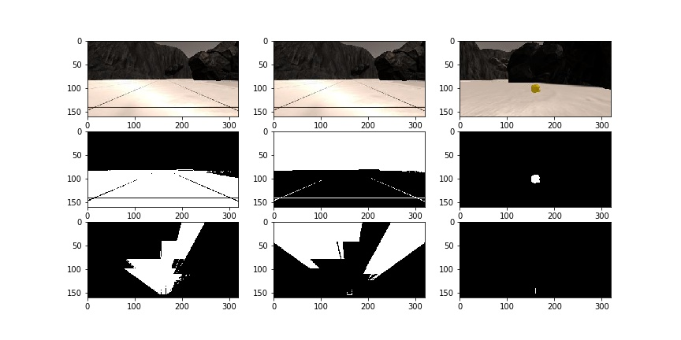
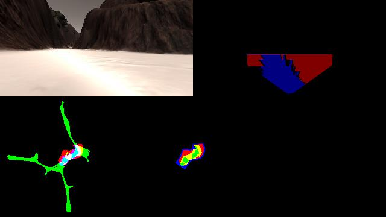
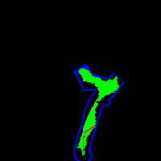

## Project: Search and Sample Return

---

### Notebook Analysis

The notebook for the most part is conceptually the same as in the lectures.
The only meaningful addition is the planning part, where the shortest
path is calculated for path planning (more on this later).

#### 1. Image analysis

Note, that I decided to first do the color threshold, then the perspective
transform, to take into account the field of view (points outside the field
of view of the camera should neither assumed to be navigable, nor obstacle).

The plot below shows navigable terrain, obstacles, and rocks:
* row 1 - original images
* row 2 - thresholded images
* row 3 - perpective transform to map



Color thresholds for rocks were identified from 6 sample images obtained
manually, see: `/calibration_images/rock{1-6}_pixels.png`

#### 2. Extending process_image(...)

The original code for process_image(..) was very dirty so I cleaned up quite
a bit:

* `def arrange_images(num_columns, *imgs)`: to separate the task of formatting the
output image from generating the images, I defined this function which can put
arbitrary images in a grid layout defined by the number of columns

* `class Perspective`: note, that essentially the same has to be done for any terrain
type (navigable, obstacle, rock). This class contains all data needed to be able to
do the perspective transform and word coordinate mapping (x, y coordinates, yaw etc).

* `class TerrainSet()`: given a `Perspective` and a thresholded image, calculates
the warped images in both rover and world coordinates.

* `class TerrainMask()`: given a `Perspective` and a rectangular range in Rover coordinates,
calculates the set of points in world coordinates

After this, I can nicely get everything I need for any kind of terrain, eg.:
```
nav_terrain = TerrainSet(persp, color_thresh(img, lo=navigable_thresh_lo))
nav_terrain.x_rover, nav_terrain.y_rover
nav_terrain.x_world, nav_terrain.y_world 
```

The set of navigable points is calculated as `Rover.navigable > 0` where I maintain
the knowledge as below, that is, observation of a pixel as navigable has 4x the weight
of the observation as obstacle.

```
Rover.navigable[nav_terrain.x_world, nav_terrain.y_world] += 4
Rover.navigable[obs_terrain.x_world, obs_terrain.y_world] -= 1
```

#### 3. Tracking unexplored areas

For path planning purposes, I will need to know where are the yet unexplored areas.
The idea is, that, the Rover should choose to go to areas where there is a chance that
it finds territory it has not seen yet (more on this later).

I could assume, that every point in the 200x200 worldmap is unexplored, that however would
yield 40K points most of which are useless. Therefore, I decided to use two masks (given in
Rover coordinates)
* `trust_area:` the area which counts as explored, eg. navigable, obstacle, or rock. I reduced
 the area to be considerably below the horizon, as pixels close to the horizon map to the
 worldmap inaccurately and seemed to mess up fidelity.
* `mask_area` = an area slightly bigger than the Rover's field of view. `mask_area - trust_area`
will be the area just outside the field of view which we will add as unexplored points.

```
current_view = TerrainSet(persp, np.ones_like(img[:,:,0]))
extended_view = TerrainMask(persp, persp.mask_area)

Rover.explored[current_view.x_world, current_view.y_world] = 1
Rover.unexplored[extended_view.x_world, extended_view.y_world] = 1
Rover.unexplored = (Rover.unexplored > 0) & (Rover.explored == 0)`
```

This is how one frame of the final image looks:
* raw camera image
* vision image: obstacles (red), navigable terrain (blue)
* map overlaid to ground truth
* Rover worldmap: obstacles (red), unexplored (blue), navigable (green)




#### 4. Path planning

I use the Dijksra algorithm from the scipy package to calculate the shortest path between
two points in the Rover's worldmap. The graph is defined as:
* the nodes are given by the navigable and the unexplored points,
* edge weights between adjacent pixels given by the Manhattan distance (no edges between two unexplored points)



I know this is very rudimentary, as the Rover is moving continuously and such paths are therefore
quite unnatural (involve unnecessary sharp turns).

How exactly this will be used in autonomous driving will be explained in the next section.

### Autonomous Navigation and Mapping

#### 1. `perception_step()`

The perception step is the same as explained above and provided in the python notebook, except:
* Rover.nav_angles is calculated as the difference of all navigable angles and the obstancle angles that are *close*:

```
obs_angles_ahead = obs_angles[np.nonzero(obs_dists < 10.0)]
Rover.nav_angles = np.setdiff1d(angles, obs_angles_ahead)
```
This is intended to remove obstacles that are blocking ahead. Unfortunatley this does not always work, when using
the mean angle, if navigable pixels are equally distributed on the sides of the obstacle.

* When rocks are identified in the camera image, their position (angle and distance) is calculated and a goal
is set for the Rover to approach.

#### 2. `decision_step()`

The decision step comes with a number of new modes compared to the bare-bones version provided.

##### Overview of Rover modes

1. *mission_complete* mode: all samples are collected and the Rover is back to closer than 3 metres
from its starting position. Stop and do nothing in this mode.
2. *forward* mode: wandering towards the mean navigable angle. After some time has passed in this state,
the Rover will change to path mode.
3. *path* mode: planning and following a path.
4. *approach* mode: when we see a sample ahead, try to approach it gradually and stop close enough
so that the Rover can pick it up.
5. *perturb* mode: occasionally, the Rover gets stuck. In that case, try random turns and backward movements
to escape.
6. *stop* mode: stop and turn back if there are not enough navigable pixels ahead, then resume planning

The more interesting modes are covered in detail below.

##### Forward mode

Wander towards the mean navigable angle, as originally provided in the bare bones version.

The only change is the transition to *path* mode, after a given time has passed in this mode:

```
if Rover.total_time - Rover.wander_start > (60.0 if Rover.total_time < 90.0 else 20.0):
                                                    Rover.switch_mode('path')
```

The right hand side of the condition expresses, that as time passes and the Rover learns more about the
environment, it should be more plan oriented.

##### Perturb mode

I detect being stuck by maintaining a sum of total throttle and distance covered during a small
interval in `Rover.step_metrics()`.

The idea is, that if the Rover steers heavily but does not cover enough distance, it is likely stuck:

```
def is_stuck(self):
    return (self.d_velocity.sum() > 0.2) and (self.d_distance.sum() < 0.08)
```

##### Approach mode

When a sample is detected in the camera image, steer directly towards it. To ensure the Rover stops
close enough to be able to pick up the sample, I define a target velocity as a function decreasing with the distance
from the goal as:

```
target_velocity = Rover.max_vel * (min(Rover.goal_distance, slow_dist) - stop_dist) / (slow_dist - stop_dist)
```

Note, that sometimes the sample detection can flicker and/or the Rover loses sight of the sample for a short time.
This resulted in occasionally passing by samples. I handled this by the feature that, once the Rover detects a sample,
it keeps believing it is there for a short time even if it can not see it:

```
elif Rover.total_time - Rover.goal_last_seen < Rover.goal_faith:
    # If a goal is believed to lie ahead, switch mode
    Rover.switch_mode('approach')
```

##### Path mode

This mode has two main parts:
* Selecting a target pixel on the worldmap and finding a shortest path to it
* Following a path if there is one already calculated

The planning is implemented in `def try_plan(Rover):` in `def try_plan(Rover)`.

The Rover decides where to go as follows:
 * if there is a sample that is discovered but not picked up, we target that location
 * if we collected all samples, the target is the middle of the map
 * otherwise, the target is the closest unexplored pixel that is reachable from the current position
 
If there is no reachable unexplored pixel either, then the planning was unsuccessful and the Rover returns
to forward mode.

If the planning was successful, the result is a path (list of worldmap pixels) to follow.

When following the path, the reached (close enough) pixels are discarded and the Rover is steered towards
the next unreached pixel of the path. When all pixels are reached, the path becomes completed and the Rover
returns to forward mode.

#### 3. Experimental Results 

The simulation is calibrated to run with the following settings:
* resolution of *1027x768*
* with *good* quality
* windowed mode

Below I collected some data by running the simulation several times in autonomous mode without manual intervention.

| Run number | Total running time | Fidelity      |  Area mapped |  Samples located   | Collected   |
|------------|--------------------|---------------|--------------|--------------------|-------------|
| 1          |  600.8s            | 67.1%         |  45.2%       |  2                 | 2           |
| 2          |  648.9s            | 64.7%         |  66.6%       |  3                 | 3           |
| 3          |  347.3%            | 69.2%         |  47.0%       |  2                 | 1           |
| 4          |  390.8%            | 72.5%         |  53.8%       |  1                 | 1           |


#### 4. Known problems and ideas for improvement 

Known issues:
* Shadows: the mountains cast shadows on the ground and sometimes they are not recognized as navigable terrain
* Small obstacles: the Rover sometimes drives into obstacles if they are small in `forward` because the mean
angle will lie just in the obstacle
* Getting stuck: sometimes what looks like navigable terrain especially close to walls, has a slope, where it
is difficult for the Rover to drive. Also, close to bigger rocks, the Rover can sink. The perturbation mode usually
solves these issues but it takes some time.
* False rocks: there are some strange mountain walls with dotted texture, and some pixels from some angles
can rarely identify as false positive for rock samples
* Path planning issues: sometimes the planning algorithm produces strange results eg. targeting an area
 of just one single unexplored pixel, effectively driving itself to the wall
* Issues approaching samples: sometimes if a sample is too close to a wall, I do not approach them from an
optimal angle, the Rover might struggle to get close enough to pick it up
* Paths too close to walls: the planning algorithm often results in paths too close to walls (because they are the
shortest) and depending on the terrain this can hinder the movement of the Rover
* Disappearing planes: this is more an issue with the simulator, sometimes driving into an obstacle means the camera
will pass through the surface of the rock and sees the area behind it

Possible improvements:
* Improved path planning algorithm to take into account the velocity and direction of the Rover to smoothen the path
* Do not plan paths close to obstacles
* Come up with a way to navigate through an area of smaller, closer obstacles
* Approach samples more optimally


